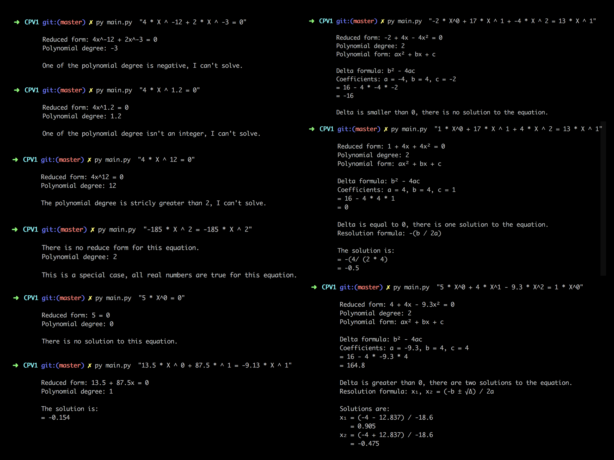

### LE PROJET EN LUI MÊME

Le but de ce sujet est de nous faire coder un programme qui résout des équations
simples. Le programme prend en paramètre une équation polynomiale. C’est-à-dire ne
faisant intervenir que des puissances, aucune fonction compliquée. Le programme devra
afficher sa (ses) solution(s).

L’idée est de nous faire (re)prendre contact avec la manipulation d’outils mathématiques élémentaires, qui pourront nous être utiles dans de nombreux autres sujets.

On considèrera toujours que **l’entrée est bien formatée**, tous les termes sont de la
forme `a ∗ x ^ p`.

Ce programme **ne résoudra pas de polynome supérieur au second degré.**

Les différentes sorties implémentées :

  
