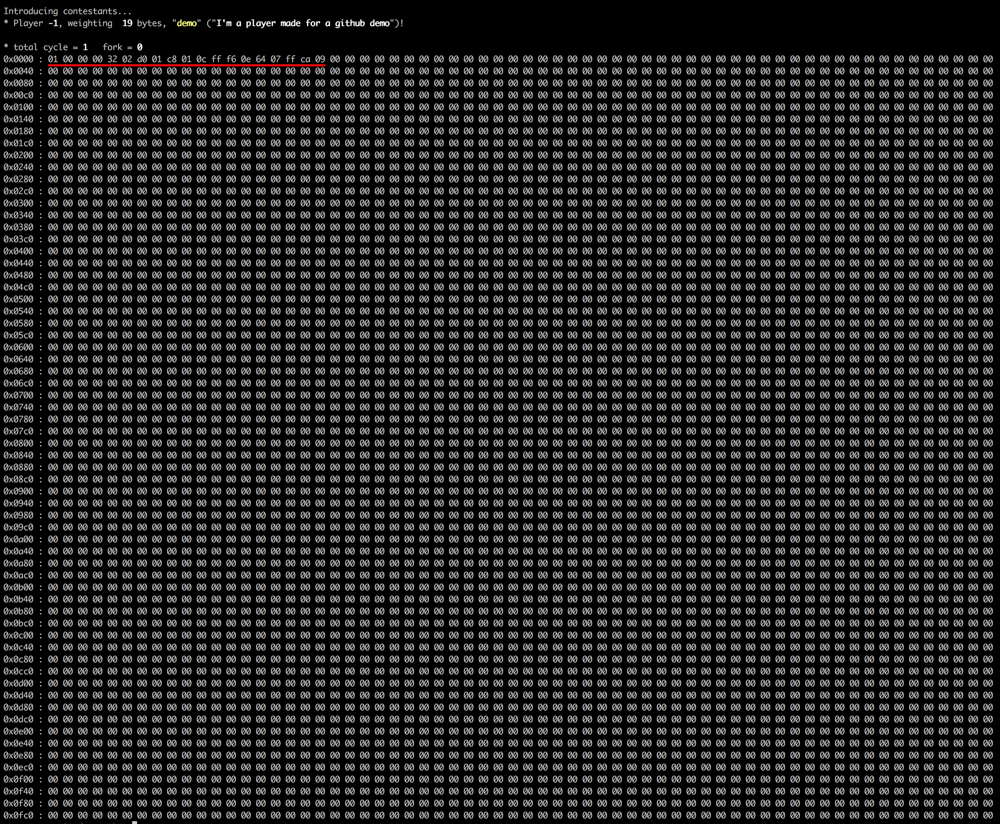

## LE PROJET EN LUI MÊME
* C’est quoi, le Corewar ?
  * Le Corewar est un jeu très particulier. Il consiste à rassembler autour d’une "machine virtuelle" des "joueurs", lesquels vont y charger des "champions" qui vont se
battre à l’aide de "processus", dans le but, entre autres, de faire en sorte qu’on dise
d’eux qu’ils sont "en vie".
  * Les processus s’exécutent séquentiellement au sein de la même machine virtuelle,
et du même espace mémoire. Ils peuvent donc, entre autre chose, s’écrire les uns
sur les autres afin de se corrompre mutuellement, de forcer les autres à exécuter
des instructions qui leur font du mal, de tenter de recréer à la volée l’équivalent
logiciel d’un Côtes du Rhône 1982, etc ...
  * Le jeu se termine quand plus aucun processus n’est en vie. À ce moment là, le
gagnant est le dernier joueur à avoir été rapporté comme étant "en vie".

* Le projet consiste à rendre trois parties distinctes :
  * L’assembleur : C’est le programme qui va compiler vos champions et les traduire
du langage dans lequel ils sont écrits (l’assembleur) vers un "bytecode", à
savoir un code machine qui sera directement interprété par la machine virtuelle.
  * La machine virtuelle : C’est l’"arène" dans laquelle les champions vont s’exécuter.
    Elle offre de nombreuses fonctionnalités, toutes utiles au combat des champions.
    Il va de soi qu’elle permet d’exécuter plusieurs processus en simultané.
  * Le champion : Il nous est également demandé d'écrire un champion capable de battre un des champions de base fournis dans les ressources du sujet, démontrant ainsi que nous avons compris le fonctionnement basique de ce dernier.

Un extrait d'une partie entre 4 joueurs : 
  
  
## L'ASSEMBLEUR

* Notre machine virtuelle va exécuter du code machine (ou "bytecode"), qui devra
être généré par notre assembleur. L’assembleur (le programme) va prendre en
entrée un fichier écrit en assembleur (le langage), et sortir un champion qui sera
compréhensible par la machine virtuelle.
* Il se lance de la façon suivante : `./asm monchampion.s`.
* Il va lire le code assembleur à traiter depuis le fichier `.s` passé en paramètre, et
écrire le bytecode résultant dans un fichier nommé comme l’entrée en remplaçant
l’extension `.s` par `.cor`.
* En cas d’erreur, nous devrons afficher un message pertinent sur la sortie d’erreur,
et ne pas produire de fichier `.cor`

* Le langage assembleur est composé d’une instruction par ligne.
* Une instruction peut se composer d'un label (optionnel), un
opcode et de ses paramètres.
* Un paramètre peut être de trois types :
    * Registre
    * Direct
    * Indirect : Une valeur ou un label représentant la valeur qui se trouve à l’adresse du paramètre, relative au PC du processus courant.
    

 

* Un label peut n’avoir aucune instruction à sa suite, ou être placé sur la ligne
d’avant l’instruction qu’il concerne.
* Le caractère `'#'` démarre un commentaire.
* Un champion comportera également un nom et une description, qui sont présents
sur une ligne après les marqueurs `.name` et `.comment`.

Un exemple de fichier `.s` : 

Le même fichier assemblé en `.cor` et convertit en hexadécimale : 

  

## LA VM

La VM va commencer par extraire les informations fournis par les joueurs puis inscrira les instructions correspondantes sur l'arène de combat.

Un dump de la mémoire avec le joueur décrit dans la partie assembleur : 
  
### Généralités (<a href="shared_includes/op.h">détails des macros<a/>)

* Les champions (de 1 à 4) sont chargés en mémoire de façon à espacer équitablement leurs
points d’entrée.

* La machine virtuelle va créer un espace mémoire dédié au combat des joueurs, puis
y charger les champions et leurs processus associés, et les exécuter séquentiellement
jusqu’à ce que mort s’ensuive.

* Tous les `CYCLE_TO_DIE` cycles, la machine doit s’assurer que chaque processus
a exécuté au moins un live depuis la dernière vérification. Un processus qui ne se
soumet pas à cette règle sera mis à mort.

* Si au cours d’une de ces vérifications on se rend compte qu’il y a eu au moins
`NBR_LIVE` exécutions de live depuis la dernière vérification en date, on décrémente `CYCLE_TO_DIE` de `CYCLE_DELTA` unités.

* Quand il n’y a plus de processus en vie, la partie est terminée.

* Le gagnant est le dernier joueur qui a été rapporté comme étant en vie. La machine va ensuite afficher : "le joueur x(nom_champion) a gagne", où x est le numéro du joueur et nom_champion le nom de son champion.

* A chaque exécution valide de l’instruction live, la machine doit afficher : "un processus dit que le joueur x(nom_champion) est en vie"

* En tout état de cause, la mémoire est circulaire et fait `MEM_SIZE` octets.

* En cas d’erreur, vous devrez afficher un message pertinent sur la sortie d’erreur.

* Si on n’a pas décrémenté `CYCLE_TO_DIE` depuis `MAX_CHECK`S vérifications, on le décrémente.

* Au bout de `nbr_cycles` cycles d’exécution, dump la mémoire sur la sortie standard, puis quitte la partie. La mémoire doit être dumpée au format hexadécimal, avec 32 octets par ligne.

* Les champions ne peuvent pas dépasser `CHAMP_MAX_SIZE`, sinon c’est une
erreur.

* Tous les adressages sont relatifs au PC et à `IDX_MOD` sauf pour lld, lldi et
lfork.

**Pour rappel le jeu se termine quand plus aucun processus n’est en vie. À ce moment là, le
gagnant est le dernier joueur à avoir été rapporté comme étant "en vie".**  
### Les processus (<a href="shared_includes/op.h">détails des macros<a/>)

Au début de la partie chaque joueur possède un processus qui aura à sa disposition les éléments suivants, qui lui sont propres :

  * `REG_NUMBER` registres qui font chacun une taille de `REG_SIZE` octets.
Un registre est une petite "case" mémoire, qui ne contient qu’une seule valeur.

  * Un PC ("Program Counter"). C’est un registre spécial, qui contient juste l’adresse,
dans la mémoire de la machine virtuelle, de la prochaine instruction à décoder et exécuter.

  * Un flag nommé carry, qui vaut 1 si la dernière opération a réussi. Seules
certaines opérations vont modifier le carry.

  * Le numéro du joueur est généré par la machine ou spécifié au lancement, et est
fourni aux champions via le registre r1 de leur premier processus au démarrage.
Tous les autres registres sont mis à 0. Sauf le PC.  
### Les instructions

* Le nombre de cycles de chaque instruction, leur représentation mnémonique, leur
nombre de paramètres et les types de paramètres possibles sont décrits dans le tableau op_tab déclaré <a href="vm_dir/srcs/utils_get_op_tab.c">ici</a>. Les cycles sont toujours consommés.

* Tous les autres codes n’ont aucune action a part passer au suivant et perdre un
cycle.

* La machine virtuelle est supposée émuler une machine parfaitement parallèle mais pour des raisons d’implémentation, on supposera que chaque instruction s’exécute entièrement a la fin de son dernier cycle et attend durant toute sa durée.

* Les instructions qui se terminent à un même cycle s’exécutent dans l’ordre décroissant des numéros de processus.

Les instructions : 
 <table>
       <tr>
            <th>LIVE</th>
       </tr>
       <tr>
            <td align="center">Opcode</td>
            <td align="center">Args</td>
            <td align="center">Binaire</td>
            <td align="center">Hexa</td>
            <td align="center">Carry</td>
            <td align="center">Ocp</td>
            <td align="center">Cycles</td>
            <td align="center">Dir size</td>
      </tr>
      <tr>
            <td align="center">1</td>
            <td align="center">T_DIR</td>
            <td align="center">00000001</td>
            <td align="center">0x01</td>
            <td align="center">Non</td>
            <td align="center">Oui</td>
            <td align="center">10</td>
            <td align="center">4</td>
      </tr>
      <tr>
            <td colspan="8">L’instruction qui permet à un processus de rester vivant. A également pour effet de rapporter que le joueur dont le numéro est en paramètre est en vie.</td>
      </tr>
</table> 
<table>
       <tr>
            <th>LD</th>
       </tr>
       <tr>
            <td align="center">Opcode</td>
            <td align="center">Args</td>
            <td align="center">Binaire</td>
            <td align="center">Hexa</td>
            <td align="center">Carry</td>
            <td align="center">Ocp</td>
            <td align="center">Cycles</td>
            <td align="center">Dir size</td>
      </tr>
      <tr>
            <td align="center">2</td>
            <td align="center">T_DIR | T_IND, T_REG</td>
            <td align="center">00000010</td>
            <td align="center">0x02</td>
            <td align="center">Oui</td>
            <td align="center">Oui</td>
            <td align="center">5</td>
            <td align="center">4</td>
      </tr>
      <tr>
            <td colspan="8">Prend un paramètre quelconque et un registre. Charge la valeur du premier paramètre dans le registre.</td>
      </tr>
</table> 
<table>
       <tr>
            <th>ST</th>
       </tr>
       <tr>
            <td align="center">Opcode</td>
            <td align="center">Args</td>
            <td align="center">Binaire</td>
            <td align="center">Hexa</td>
            <td align="center">Carry</td>
            <td align="center">Ocp</td>
            <td align="center">Cycles</td>
            <td align="center">Dir size</td>
      </tr>
      <tr>
            <td align="center">3</td>
            <td align="center">T_REG, T_IND | T_REG</td>
            <td align="center">00000011</td>
            <td align="center">0x03</td>
            <td align="center">Non</td>
            <td align="center">Oui</td>
            <td align="center">5</td>
            <td align="center">/</td>
      </tr>
      <tr>
            <td colspan="8">Prend un registre et un registre ou un indirect, et stocke la valeur du registre vers le second paramètre. Par exemple, st r1, 42 stocke la valeur de r1 à l’adresse (PC + (42 % IDX_MOD)).</td>
      </tr>
</table> 
<table>
       <tr>
            <th>ADD</th>
       </tr>
       <tr>
            <td align="center">Opcode</td>
            <td align="center">Args</td>
            <td align="center">Binaire</td>
            <td align="center">Hexa</td>
            <td align="center">Carry</td>
            <td align="center">Ocp</td>
            <td align="center">Cycles</td>
            <td align="center">Dir size</td>
      </tr>
      <tr>
            <td align="center">4</td>
            <td align="center">T_REG | T_REG | T_REG</td>
            <td align="center">00000100</td>
            <td align="center">0x04</td>
            <td align="center">Oui</td>
            <td align="center">Oui</td>
            <td align="center">10</td>
            <td align="center">/</td>
      </tr>
      <tr>
            <td colspan="8">Prend trois registres, additionne les 2 premiers, et met le résultat dans le troisième.</td>
      </tr>
</table> 
<table>
       <tr>
            <th>SUB</th>
       </tr>
       <tr>
            <td align="center">Opcode</td>
            <td align="center">Args</td>
            <td align="center">Binaire</td>
            <td align="center">Hexa</td>
            <td align="center">Carry</td>
            <td align="center">Ocp</td>
            <td align="center">Cycles</td>
            <td align="center">Dir size</td>
      </tr>
      <tr>
            <td align="center">5</td>
            <td align="center">T_REG | T_REG | T_REG</td>
            <td align="center">00000101</td>
            <td align="center">0x05</td>
            <td align="center">Oui</td>
            <td align="center">Oui</td>
            <td align="center">10</td>
            <td align="center">/</td>
      </tr>
      <tr>
            <td colspan="8">Prend trois registres, soustrait les 2 premiers, et met le résultat dans le troisième.</td>
      </tr>
</table> 
<table>
       <tr>
            <th>AND</th>
       </tr>
       <tr>
            <td align="center">Opcode</td>
            <td align="center">Args</td>
            <td align="center">Binaire</td>
            <td align="center">Hexa</td>
            <td align="center">Carry</td>
            <td align="center">Ocp</td>
            <td align="center">Cycles</td>
            <td align="center">Dir size</td>
      </tr>
      <tr>
            <td align="center">6</td>
            <td align="center">T_REG | T_REG | T_REG</td>
            <td align="center">00000110</td>
            <td align="center">0x06</td>
            <td align="center">Oui</td>
            <td align="center">Oui</td>
            <td align="center">10</td>
            <td align="center">/</td>
      </tr>
      <tr>
            <td colspan="8">Prend trois registres, fait un ET logique entre les 2 premiers, et met le résultat dans le troisième.</td>
      </tr>
</table> 
<table>
       <tr>
            <th>OR</th>
       </tr>
       <tr>
            <td align="center">Opcode</td>
            <td align="center">Args</td>
            <td align="center">Binaire</td>
            <td align="center">Hexa</td>
            <td align="center">Carry</td>
            <td align="center">Ocp</td>
            <td align="center">Cycles</td>
            <td align="center">Dir size</td>
      </tr>
      <tr>
            <td align="center">7</td>
            <td align="center">T_REG | T_REG | T_REG</td>
            <td align="center">00000111</td>
            <td align="center">0x07</td>
            <td align="center">Oui</td>
            <td align="center">Oui</td>
            <td align="center">10</td>
            <td align="center">/</td>
      </tr>
      <tr>
            <td colspan="8">Prend trois registres, fait un OU inclusif entre les 2 premiers, et met le résultat dans le troisième.</td>
      </tr>
</table> 
<table>
       <tr>
            <th>XOR</th>
       </tr>
       <tr>
            <td align="center">Opcode</td>
            <td align="center">Args</td>
            <td align="center">Binaire</td>
            <td align="center">Hexa</td>
            <td align="center">Carry</td>
            <td align="center">Ocp</td>
            <td align="center">Cycles</td>
            <td align="center">Dir size</td>
      </tr>
      <tr>
            <td align="center">8</td>
            <td align="center">T_REG | T_REG | T_REG</td>
            <td align="center">00001000</td>
            <td align="center">0x08</td>
            <td align="center">Oui</td>
            <td align="center">Oui</td>
            <td align="center">10</td>
            <td align="center">/</td>
      </tr>
      <tr>
            <td colspan="8">Prend trois registres, fait un OU exclusif entre les 2 premiers, et met le résultat dans le troisième.</td>
      </tr>
</table> 
<table>
       <tr>
            <th>ZJMP</th>
       </tr>
       <tr>
            <td align="center">Opcode</td>
            <td align="center">Args</td>
            <td align="center">Binaire</td>
            <td align="center">Hexa</td>
            <td align="center">Carry</td>
            <td align="center">Ocp</td>
            <td align="center">Cycles</td>
            <td align="center">Dir size</td>
      </tr>
      <tr>
            <td align="center">9</td>
            <td align="center"><T_DIR/td>
            <td align="center">00001001</td>
            <td align="center">0x09</td>
            <td align="center">Non</td>
            <td align="center">Non</td>
            <td align="center">20</td>
            <td align="center">2</td>
      </tr>
      <tr>
            <td colspan="8">Prend un index, et fait un saut à cette adresse si le carry est à 1.</td>
      </tr>
</table> 
<table>
       <tr>
            <th>LDI</th>
       </tr>
       <tr>
            <td align="center">Opcode</td>
            <td align="center">Args</td>
            <td align="center">Binaire</td>
            <td align="center">Hexa</td>
            <td align="center">Carry</td>
            <td align="center">Ocp</td>
            <td align="center">Cycles</td>
            <td align="center">Dir size</td>
      </tr>
      <tr>
            <td align="center">10</td>
            <td align="center">T_REG | T_DIR | T_IND, T_DIR | T_REG, T_REG</td>
            <td align="center">00001010</td>
            <td align="center">0x0A</td>
            <td align="center">Non</td>
            <td align="center">Oui</td>
            <td align="center">25</td>
            <td align="center">2</td>
      </tr>
      <tr>
            <td colspan="8">Prend 2 index et 1 registre, additionne les 2 premiers, traite ca comme une adresse, y lit une valeur de la taille d’un registre et la met dans le 3eme.</td>
      </tr>
</table> 
<table>
       <tr>
            <th>STI</th>
       </tr>
       <tr>
            <td align="center">Opcode</td>
            <td align="center">Args</td>
            <td align="center">Binaire</td>
            <td align="center">Hexa</td>
            <td align="center">Carry</td>
            <td align="center">Ocp</td>
            <td align="center">Cycles</td>
            <td align="center">Dir size</td>
      </tr>
      <tr>
            <td align="center">11</td>
            <td align="center">T_REG, T_REG | T_DIR | T_IND, T_DIR | T_REG</td>
            <td align="center">00001011</td>
            <td align="center">0x0B</td>
            <td align="center">Non</td>
            <td align="center">Oui</td>
            <td align="center">25</td>
            <td align="center">2</td>
      </tr>
      <tr>
            <td colspan="8">Prend un registre, et deux index (potentiellement des registres). Additionne les deux derniers, utilise cette somme comme une adresse ou sera copiée la valeur du premier paramètre.</td>
      </tr>
</table> 
<table>
       <tr>
            <th>FORK</th>
       </tr>
       <tr>
            <td align="center">Opcode</td>
            <td align="center">Args</td>
            <td align="center">Binaire</td>
            <td align="center">Hexa</td>
            <td align="center">Carry</td>
            <td align="center">Ocp</td>
            <td align="center">Cycles</td>
            <td align="center">Dir size</td>
      </tr>
      <tr>
            <td align="center">12</td>
            <td align="center">T_DIR</td>
            <td align="center">00001100</td>
            <td align="center">0x0C</td>
            <td align="center">Non</td>
            <td align="center">Non</td>
            <td align="center">800</td>
            <td align="center">2</td>
      </tr>
      <tr>
            <td colspan="8">Crée un nouveau processus, qui hérite des différents états de son père, à part son PC, qui est mis à (PC + (1er paramètre % IDX_MOD)).</td>
      </tr>
</table> 
<table>
       <tr>
            <th>LLD</th>
       </tr>
       <tr>
            <td align="center">Opcode</td>
            <td align="center">Args</td>
            <td align="center">Binaire</td>
            <td align="center">Hexa</td>
            <td align="center">Carry</td>
            <td align="center">Ocp</td>
            <td align="center">Cycles</td>
            <td align="center">Dir size</td>
      </tr>
      <tr>
            <td align="center">13</td>
            <td align="center">T_DIR | T_IND, T_REG</td>
            <td align="center">00001101</td>
            <td align="center">0x0D</td>
            <td align="center">Oui</td>
            <td align="center">Oui</td>
            <td align="center">10</td>
            <td align="center">4</td>
      </tr>
      <tr>
            <td colspan="8">C’est la même chose que ld, mais sans % IDX_MOD.</td>
      </tr>
</table> 
<table>
       <tr>
            <th>LLDI</th>
       </tr>
       <tr>
            <td align="center">Opcode</td>
            <td align="center">Args</td>
            <td align="center">Binaire</td>
            <td align="center">Hexa</td>
            <td align="center">Carry</td>
            <td align="center">Ocp</td>
            <td align="center">Cycles</td>
            <td align="center">Dir size</td>
      </tr>
      <tr>
            <td align="center">14</td>
            <td align="center">T_REG | T_DIR | T_IND, T_DIR | T_REG, T_REG</td>
            <td align="center">00001110</td>
            <td align="center">0x0E</td>
            <td align="center">Oui</td>
            <td align="center">Oui</td>
            <td align="center">50</td>
            <td align="center">2</td>
      </tr>
      <tr>
            <td colspan="8">C'est la même chose que ldi, mais sans % IDX_MOD.</td>
      </tr>
</table> 
<table>
       <tr>
            <th>LFORK</th>
       </tr>
       <tr>
            <td align="center">Opcode</td>
            <td align="center">Args</td>
            <td align="center">Binaire</td>
            <td align="center">Hexa</td>
            <td align="center">Carry</td>
            <td align="center">Ocp</td>
            <td align="center">Cycles</td>
            <td align="center">Dir size</td>
      </tr>
      <tr>
            <td align="center">15</td>
            <td align="center">T_DIR</td>
            <td align="center">00001111</td>
            <td align="center">0x0F</td>
            <td align="center">Non</td>
            <td align="center">Non</td>
            <td align="center">1000</td>
            <td align="center">2</td>
      </tr>
      <tr>
            <td colspan="8">C'est la même chose que lfork, mais sans % IDX_MOD.</td>
      </tr>
</table> 
<table>
       <tr>
            <th>AFF</th>
       </tr>
       <tr>
            <td align="center">Opcode</td>
            <td align="center">Args</td>
            <td align="center">Binaire</td>
            <td align="center">Hexa</td>
            <td align="center">Carry</td>
            <td align="center">Ocp</td>
            <td align="center">Cycles</td>
            <td align="center">Dir size</td>
      </tr>
      <tr>
            <td align="center">16</td>
            <td align="center">T_REG</td>
            <td align="center">00010000</td>
            <td align="center">0x10</td>
            <td align="center">Non</td>
            <td align="center">Oui</td>
            <td align="center">2</td>
            <td align="center">/</td>
      </tr>
      <tr>
            <td colspan="8">le contenu est interprété comme la valeur ASCII d’un caractère à afficher sur la
sortie standard. Ce code est modulo 256.</td>
      </tr>
</table>
  
 
### Compilation et lancement de la VM

La VM se compile à l'aide de `make`.

La partie se lance selon l'usage suivant : 

Pour un lancement classique il produira la sortie suivante : 

  
## BONUS

### Verbose

Nous avons implémentés une verbose selon la logique suivante : 

`./corewar ... --verbose (-v)   <Number>` pour controlé le défilement de la verbose ajouter le flag `-s`.

verbose mode :
* 1 : print base
* 2 : Print cycle_to_die
* 4 : Print instruction
* 8 : Print Kill process
* 16 : Print pc mouvement

Un exemple en situation : 

  

### Partie Graphique

Pour ce projet nous avons mis en place 3 modes d'affichages à l'aide la SDL :
 

 
   
   
  

  
Nous avons également implémenté la possibilité d'afficher des animations au début et à la fin de chaque partie.
 

 
  
  

  

### DSM

Vous trouverez à la racine du projet un désassembleur de fichier `.cor` qui vous recréera le fichier `.s` correspondant.
Vous pourrez le tester à l'aide de : `./dsm votre_fichier.cor`.
  
### SCRIPTS

Trois scripts ont été implémentés pour créer des champions :
* Un générateur de champion aléatoire : `sh ./script/champion_generator.sh`. 
Un fichier `Random_Commodore.s` sera ajouté dans `ressource/source/` et un `Random_Commodore.cor` dans `ressource/compile/`.
* Un générateur de champion battant à coup sûr le champion passé en paramètre : `sh ./script/beat_champion <champ_to_beat.cor>`. 
Un fichier `ChampToBeat_Nemesis.s` sera ajouté dans `ressource/source/` et un `ChampToBeat_Nemesis.cor` dans `ressource/compile/`.
* Un améliorateur de champion qui fera jouer un champion passé en premier paramètre contre des joueurs générés aléatoirement jusqu'à ce qu'un de ces joueurs arrivent à battre votre joueur.
Il vérifiera également que ce champion arrive à battre à minima les mêmes champions que le votre.
Si c'est le cas `Darwin.s` et un `Darwin.cor` seront ajoutés aux mêmes endroits que précédemment sinon le script continuera simplement à boucler.
Ce script ce test à l'aide de `sh ./script/train_champion.sh <your_champ.cor>`

