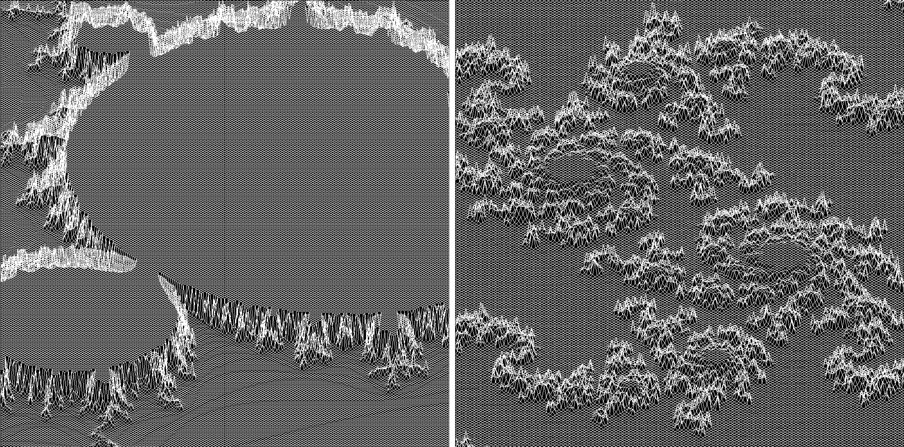

## LE PROJET EN LUI MÊME

Fdf est un projet nous permettant de découvrir les bases de la programmation graphique, et en particulier, le placement de points dans l’espace, comment les relier avec des segments et
surtout comment observer la scène depuis un certain point de vue.
C'est égalemet à cette occasion que nous découvrirons notre première bibliothèque graphique : La miniLibX.
Cette bibliothèque développée en interne rassemble le minimum nécéssaire pour ouvrir une
fenêtre, allumer un pixel et gérer les évènements lié à cette fenêtre : le clavier et la souris.
C'est pour nous l’occasion de nous initier à la programmation dite “evenementielle”.
  
## LANCER LE PROJET

Une fois le repo téléchargé un simple `make` suffira à compiler le projet.

Vous l'exécuterez à l'aide de la commande `./fdf votre_map`.

Le dossier `map` contient plusieurs cartes pour tester le programme.

Nous devions réaliser deux type de projections, j'ai choisi pour ma part d'implémenter la parallèle et l'isométrique.

  
  

 

## ÉVÉNEMENTS

Les événements suivant ont été implémentés :
* Déplacements hauts/bas/gauches/droites
* Modification de l'élévation (axe z)
* Changement des couleurs (en dégradé)
* Rotation axe X/Y/Z
* Zoom
* Affichage ou non de l'HUD
* Changement d'algorithme de tracé (l'un développé par un étudiant de l'école l'autre par Xiaolin-Wu)
* Changement de projection
 

  
   
Vu de base du projet (avec HUD)

 

  
  
Différence entre les deux algos de tracé de segment

 

  
  
Détails des fractales Mandelbrot et Julia

 

  
  
Rotations axe X/Y/Z et couleurs

