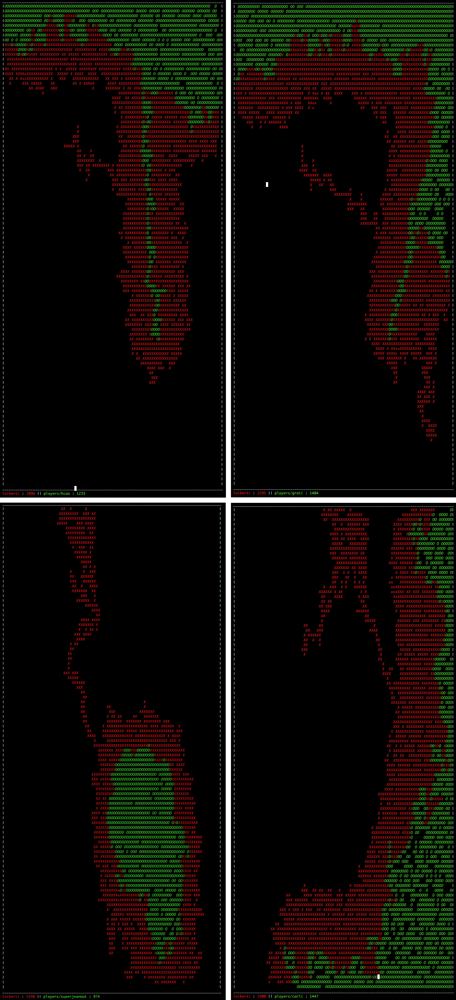

## LE PROJET EN LUI MÊME

Filler est un jeu algorithmique qui consiste à remplir une grille d’une taille connue
à l’avance avec des pièces de taille et de formes aléatoires, sans que les pièces ne se superposent de plus d’une seule case et sans qu’elles ne depassent de la grille. Si l’une de
ces conditions n’est pas remplie, la partie s’arrête.

Chaque pièce posée avec succès rapporte un certain nombre de points, et a un seul
joueur, le but du jeu pourrait être d’obtenir le meilleur score possible. Cepedant, c’est
avec deux joueurs que le filler prend tout son intérêt. Chaque joueur a pour but de poser
un maximum de pièces tout en tentant d’empêcher son adversaire de le faire. A la fin de
la partie, celui avec le plus de point remporte le match.

Pour ce projet, j'ai choisi de mettre en place un algorithme d'heat map, l'idée est d'à partir de l'état actuelle de la grille de déterminer la meilleur position possible où poser sa pièce.

Le projet se compile avec `make` et se lance à l'aide d'une vm fournit dans les ressources disponibles au début du projet.
Il existe trois tailles de map pour ce projet, il est également possible de changer le point de départ de la partie en précisant le numéro de player des joueurs.

Un exemple de lancement du programme : `./resources/filler_vm -f resources/maps/map02 -p1 resources/players/grati.filler -p2 resources/players/loiberti.filler`

## BONUS

Un visualisateur est disponible en rajoutant un `| ./loiberti.vm` à la fin de votre commande.

