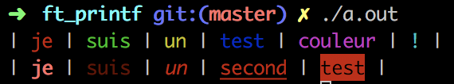

## LE PROJET EN LUI MÊME

Pour ce projet nous devions recoder une partie de la fonction `printf` de la libc, nous avions les consignes suivantes :

* Votre fonction s’appelera ft_printf et sera prototypée de la même façon que
printf
* Vous ne ferez pas la gestion de buffer présente dans la fonction printf de la libc.
* Vous devez gérer les conversions suivantes : csp
* Vous devez gérer les conversions suivantes : diouxX avec les flags hh, h, l, ll
* Vous devez gérer la conversion suivante : f avec les flags l et L
* Vous devez gérer le %%
* Vous devez gérer les flags #0-+ et espace
* Vous devez gérer la taille minimum du champ
* Vous devez gérer la précision

## BONUS

<a href="http://www.linux-france.org/article/man-fr/man3/printf-3.html">Sprintf</a> a été implémentés et les couleurs ont également été ajouté selon la logique suivante :  `ft_printf("%<your_color_code>$<your_type_of_conversion>", your_var)`

Les codes couleurs sont les suivants :

