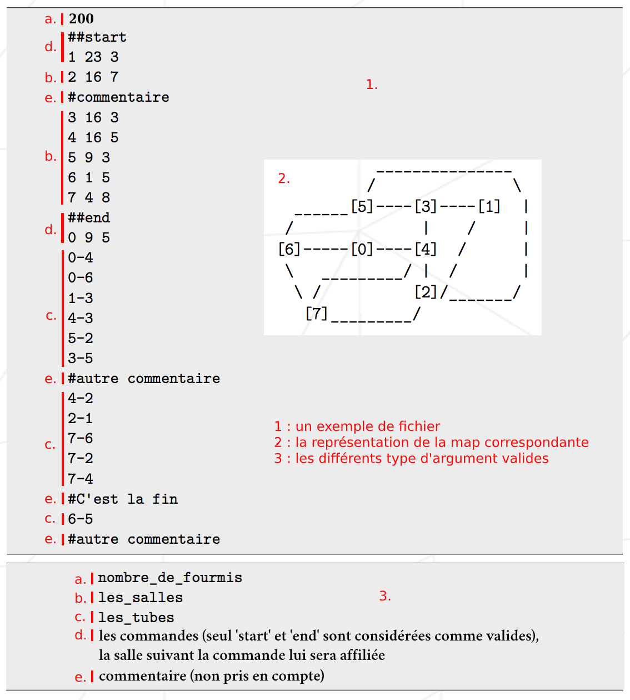

## LE PROJET EN LUI MÊME

Ce projet est une introduction à la problématique des algos de pathfinding et aux parcours de graphes.
  Il s'agit de trouver la meilleure solution possible pour relier un point A à un point B jalonné de plusieurs étapes ou non // rajouter le nombre importants ou non de parcourant.

Le fichier que l'on fera lire par notre programme décrit une fourmilière caractérisée par :
* Son nombre de fourmis
* Ses salles
* Les liaisons entre ces salles

Au premier tour toutes les fourmis sont présentes dans la salle `start`, si la fourmilière transmise est valide le programme s'arrête quand toute les fourmis ont atteint la salle `end`.
 Il ne peut y avoir qu'une fourmi par salle et elles ne peuvent se déplacer que d'une salle par tour.

Pour une meilleure compréhension, voici un descriptif du type de fichier (la fourmilière) à passer en argument au programme : 

## CAS D'UNE FOURMILIÈRE PARTIELLEMENT/COMPLÈTEMENT INVALIDE

Ce fichier peut être invalide pour différentes raisons :
* Fichier invalide (problème de droit, pas un fichier texte...)
* Il manque le nombre de fourmis/la description des salles/les liaisons
* Il n'y a aucun chemin permettant de relier les salle `start` et `end`
* Les salles `start`/`end` ne sont pas présentes

Dans ces cas, `ERROR` sera imprimé sur la sortie standard.

Si une ligne de la fourmilière n'est pas valide, à savoir :
* Une commande (##something) n'étant pas suivi de `start` ou `end`
* La répétition d'une commande valide déja fournit, d'une salle, ou d'une liaison
* Tout autre chose qui n'a rien a faire là

Deux cas de figure sont possibles :

* Si les informations précédents cette ligne fournissent une fourmilière valide, on la traite telle quelle et on ignore le reste du fichier à partir de cette ligne
* Sinon, `ERROR` sera affiché sur la sortie standard

## CAS D'UNE FOURMILIÈRE VALIDE

Dans ce cas, le programme imprimera en premier le contenu du fichier exploité, suivit des déplacements des fourmis (une ligne correspondant à un tour) ; Lx-y Lz-w Lr-o ...
Où x, z, r sont des numéros de fourmis (allant de 1 à nombre_de_fourmis) et y, w, o des noms de salles.

// à préciser

Exemple de déplacements réalisés par les fourmis (la description de la fourmilière n'est pas présente pour des soucis de lisibilité mais est disponible <a href="map_tmp">ici</a>) : 

## ALGO ET OPTIMISATION

Pour avoir le maximum de point dans ce projet nous avions deux problématiques à concilier, le fait d'avoir un algo nous permettant de trouver le plus de chemins cours sans intersection entre eux et le fait d'avoir un algo le plus rapide possible.

Nous avons donc choisis d'implémenter <a href="https://fr.wikipedia.org/wiki/Algorithme_A*">l'algorithme A*<a/> offrant un bon équillibre entre ces deux problématiques et de faire nos parcours de chemin pour la résolution à travers une <a href="https://fr.wikipedia.org/wiki/Matrice_d%27adjacence">matrice d'adjacence<a/> offrant ainsi la possibilitée d'utiliser des opérateurs binaires et d'allouer la mémoire au bit prêt et donc d'obtenir un gain de temps considerable.
  
## COMPILATION ET BONUS

Le projet se compile à l'aide de `make` et est exécuté comme suit : `./lem-in < your_map`.

Un générateur de map nous est fournit au commencement du projet, nous avons implémenté un script pour chaque type de map possible (chacun d'eux vous créera une `map_tmp` à la racine du projet) :
* `./tools/fl-1` générera une map avec 1 fourmi
* `./tools/fl-10` générera une map avec 10 fourmis
* `./tools/fl-100` générera une map avec 100 fourmis
* `./tools/big` générera une map avec beaucoup de fourmis et beaucoup de salles
* `./tools/big-s` idem que pour les `big` mais avec énormément de connexion entre les salles

Ces scripts produiront la sortie suivante :

Où l'on peut voir dans l'ordre :
* en bleu le nombre de tour nécessaire à notre programme pour placer toute les fourmis
* en magenta la différence avec la recommandation donnée par le générateur de map
* en vert `GOOD` si le résultat est égal/inférieur à la recommandation ou en rouge `FALSE` dans le cas contraire
* le temps prit par le programme
* le nombre de fourmis présentes dans la fourmilière
* la recommandation du nombre de tour nécessaire pour placer toute les fourmis
