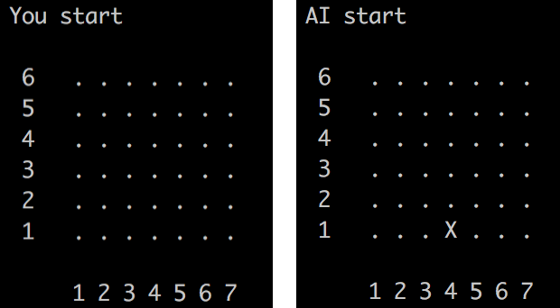
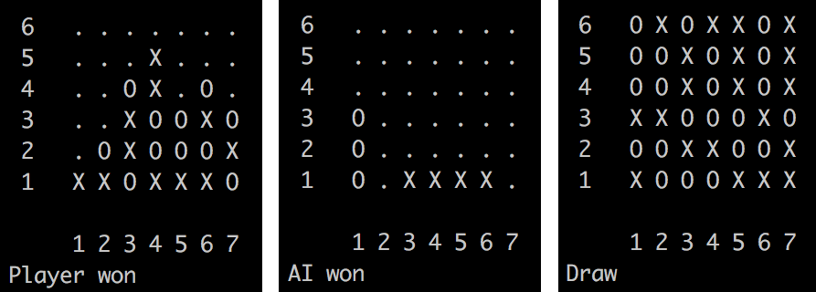

## LE PROJET EN LUI MÊME

Pour ce projet nous devions recréer un jeu de puissance 4 ou le joueur (nous) jouerait contre un programme.
Nous avons choisis que les jetons du joueur seraient symbolisés par des 'O' et ceux du programme par des 'X'.

Pour rappel les règles du puissance 4 sont les suivantes :
* À tour de rôle, chaque joueur pose un jeton
* Le premier joueur à aligner 4 jetons horizontalement, verticalement ou en diagonale remporte la partie.

Qui du joueur ou du programme commencera la partie est déterminé aléaoirement : 

Trois types de fin de partie sont possibles :

