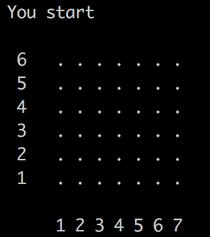

## LE PROJET EN LUI MÊME

Pour ce projet nous devions recréer un jeu de puissance 4 ou le joueur (nous) jouerait contre un programme.

Pour rappel les règles du puissance 4 sont les suivantes :
* Chaque joueur pose un jeton à tour de rôle
* Le premier joueur à aligner 4 jetons horizontalement, verticalement ou en diagonale remporte la partie.

Qui du joueur ou du programme commence la partie est déterminé aléaoirement : 

 
  
  

